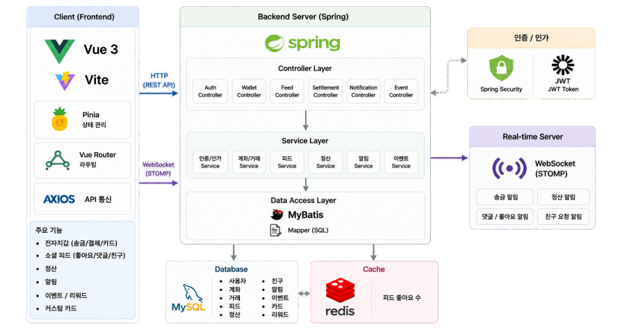

#  Social Wallet

> ### **결제는 순식간, 소통은 자연스럽게**
>
> 금융 거래를 **소셜 콘텐츠로 확장**하고,
> 금융 데이터를 **읽고 즐기는 콘텐츠**로 제공하는 소셜 지갑 서비스

<br>

<p align="center">
  
</p>

<p align="center">
  <b>KB IT's Your Life 7기 · 30반 2팀 · 5성급 개발자</b>
</p>

<p align="center">
  
  
  
  
  
  
</p>

<br>

---

#  목차

* [프로젝트 개요](#-프로젝트-개요)
* [기획 배경](#-기획-배경)
* [팀 구성](#-팀-구성)
* [개발 환경 및 기술 스택](#-개발-환경-및-기술-스택)
* [주요 기능](#-주요-기능)
* [시스템 아키텍처](#-시스템-아키텍처)
* [데이터베이스](#-데이터베이스)
* [주요 기술 구현](#-주요-기술-구현)
* [개발 이슈 및 해결](#-개발-이슈-및-해결)
* [서비스 화면](#-서비스-화면)
* [시연 영상](#-시연-영상)
* [향후 개선](#-향후-개선)
* [프로젝트 회고](#-프로젝트-회고)

---

#  프로젝트 개요

| 구분         | 내용                   |
| ---------- | -------------------- |
| **프로젝트명**  | Social Wallet        |
| **교육 과정**  | KB IT's Your Life 7기 |
| **팀**      | 30반 2팀 · 5성급 개발자     |
| **개발 기간**  | 2026.07 ~ 2026.08    |
| **개발 인원**  | 5명                   |
| **서비스 유형** | 금융 · 소셜 플랫폼          |

### 한 줄 소개

**Social Wallet은 금융 거래와 소셜 활동을 결합한 전자지갑 서비스입니다.**

송금·결제·정산과 같은 금융 활동을 단순한 거래 내역으로 끝내지 않고
**피드 콘텐츠로 확장하여 친구들과 공유하고 소통할 수 있도록 설계했습니다.**

또한 12개월 소비 데이터를 기반으로 AI 소비 분석을 제공하고,
커스텀 카드·이벤트·리워드 등 다양한 콘텐츠를 통해 사용자의 서비스 체류와 참여를 유도합니다.

---

#  기획 배경

### 기존 금융 서비스의 한계

기존 금융 앱은 일반적으로

```text
금융 활동
   ↓
결제 / 송금 완료
   ↓
서비스 이용 종료
```

와 같은 구조로 사용자의 금융 활동이 **거래 완료와 동시에 종료**됩니다.

또한 금융 서비스 특성상 사용자가 서비스를 지속적으로 방문할 수 있는
콘텐츠와 소셜 경험이 부족하다는 점에 주목했습니다.

### Social Wallet의 방향

```text
금융 거래
   ↓
소셜 콘텐츠
   ↓
친구와 공유
   ↓
좋아요 / 댓글 / 소통
   ↓
서비스 재방문
```

금융 거래를 **소셜 콘텐츠로 확장**하고,
소비 데이터를 **AI 기반 콘텐츠로 제공**하여
사용자의 자연스러운 서비스 이용을 유도하는 것을 목표로 했습니다.

---

#  팀 구성

|    팀원   | 역할              | 주요 담당                          |
| :-----: | --------------- | ------------------------------ |
| **이승진** | 팀장 · 발표 · UI/UX | 전자지갑 · 결제 · 송금 · 더치페이          |
| **박우진** | PM · Git/API 관리 | **소셜 피드 · 커스텀 카드 · 정산 · 알림**   |
| **박준우** | DBA · QA        | 포인트 지갑 · AI 소비분석 · 상품 추천 · 이벤트 |
| **이효능** | UI/UX · 발표      | 인증 · 회원 · 프로필 · 계좌 연결          |
| **허현정** | UI/UX           | 이벤트 서비스 · 커스텀 카드 일부            |


### Social Feed

* 송금 / 결제 / 정산 기반 피드
* 공개 / 친구 / 내 피드
* 무한 스크롤
* 좋아요 / 댓글
* 피드 공개 범위
* 피드 상세 및 상태 관리

### Real-time

* WebSocket + STOMP 연동
* 친구 요청 / 수락 알림
* 정산 요청 알림
* 좋아요 / 댓글 알림

### Custom Card

* 카드 디자인
* 배경 / 패턴
* 텍스트 / 이모지
* 이미지 업로드
* 카드 발급 및 공유

### 기타

* 정산 기능
* 소비 분석 결과 공유
* 이벤트 결과 공유
* Git / API 관리
* 팀 개발 규칙 관리

</details>

---

# 🛠 개발 환경 및 기술 스택

## Frontend

| 기술                          | 용도           |
| --------------------------- | ------------ |
| **Vue 3**                   | SPA 기반 프론트엔드 |
| **Vite**                    | 개발 서버 및 빌드   |
| **Pinia**                   | 전역 상태 관리     |
| **Vue Router**              | 페이지 라우팅      |
| **Axios**                   | REST API 통신  |
| **HTML / CSS / JavaScript** | UI 구현        |

## Backend

| 기술                   | 용도            |
| -------------------- | ------------- |
| **Java**             | Backend       |
| **Spring Framework** | REST API 및 서버 |
| **Spring Security**  | 인증 / 인가       |
| **MyBatis**          | SQL Mapper    |
| **JWT**              | 사용자 인증        |
| **Jsoup**            | 웹 크롤링         |

## Database / Infrastructure

| 기술         | 용도          |
| ---------- | ----------- |
| **MySQL**  | 관계형 데이터베이스  |
| **Redis**  | 좋아요 처리 및 캐싱 |
| **Docker** | 개발 환경 구성    |

## Real-time / AI

| 기술             | 용도                 |
| -------------- | ------------------ |
| **WebSocket**  | 실시간 통신             |
| **STOMP**      | 메시징 프로토콜           |
| **SockJS**     | WebSocket fallback |
| **OpenAI API** | AI 소비 분석           |

## Collaboration

* Git
* GitHub
* Notion
* Discord
* IntelliJ IDEA
* Visual Studio Code

---

# ✨ 주요 기능

##  01. 전자지갑 & 금융 거래

### 계좌 연결 및 관리

* 계좌 인증
* 계좌 연결 / 해제
* 대표 계좌 설정
* 연결 계좌 조회

### 송금

* 친구 송금
* 계좌번호 송금
* 간편 비밀번호 인증
* 송금 내역 관리

### 결제

* 카드 결제
* 결제 승인
* 결제 취소
* 결제 상태 관리

### 통합 금융 Pipeline

금융 거래가 완료되면 관련 기능을 하나의 흐름으로 연결했습니다.

```text
송금 / 결제 / 정산
        ↓
지갑 잔액 변경
        ↓
소비 내역 생성
        ↓
소셜 피드 생성
        ↓
리워드 지급
```

---

#  02. Social Feed

금융 거래를 **소셜 콘텐츠**로 확장했습니다.

### Feed Type

| 유형            | 설명     |
| ------------- | ------ |
|  Transfer   | 송금 활동  |
|  Payment    | 결제 활동  |
|  Settlement | 정산 활동  |
|  Event      | 이벤트 활동 |
| 🎨 Card       | 커스텀 카드 |
|  Analysis   | 소비 분석  |

### Feed

* 공개 피드
* 친구 피드
* 내 피드
* 무한 스크롤
* 좋아요
* 댓글
* 피드 삭제
* 공개 범위 설정

### 공개 범위

```text
PUBLIC
 └─ 전체 사용자

FRIEND
 └─ 친구 사용자

PRIVATE
 └─ 본인
```

금융 서비스 특성을 고려하여
공개 범위에 따라 **거래 금액과 민감 정보의 노출 범위**를 다르게 처리했습니다.

---

#  03. Redis 기반 좋아요

좋아요는 짧은 시간에 많은 요청이 발생할 수 있는 기능이므로
Redis를 활용하여 빠르게 처리하도록 구현했습니다.

```text
Client
   ↓
Like Request
   ↓
Spring
   ↓
Redis Set
   ↓
Like 상태 반영
   ↓
Background DB Sync
```

### 적용 내용

* Redis Set 기반 중복 좋아요 방지
* 빠른 상태 반영
* DB 부하 감소
* 백그라운드 DB 동기화

---

#  04. 실시간 알림

WebSocket + STOMP를 이용해
페이지 새로고침 없이 실시간 알림을 제공합니다.

### 알림 유형

* 좋아요
* 댓글
* 친구 요청
* 친구 수락
* 친구 거절
* 정산 요청
* 정산 결제
* 정산 취소

### 사용자별 Queue

```text
/user/queue/notifications
/user/queue/settlements
```

사용자별 Queue를 통해 필요한 사용자에게만 이벤트를 전달합니다.

---

#  05. AI 소비 분석

최근 **12개월 소비 데이터**를 기반으로
사용자의 소비 패턴을 분석합니다.

### 제공 기능

* 월별 소비 분석
* 카테고리별 소비 분석
* AI 소비 칭호
* 소비 패턴 분석
* 소비 분석 결과 공유

### AI 분석 Pipeline

```text
12개월 소비 데이터
        ↓
데이터 전처리
        ↓
가맹점 분류
        ↓
AI 소비 패턴 분석
        ↓
AI 칭호 생성
        ↓
결과 저장
        ↓
사용자 제공
```

### AI 호출 최적화

가맹점 카테고리 분류 시
`merchant_category_mapping_tbl`을 우선 조회하여
이미 분류된 가맹점은 AI를 재호출하지 않도록 구현했습니다.

```text
가맹점 조회
   ↓
Mapping Table 조회
   ↓
 ┌───────────────┐
 │ 기존 데이터 존재 │
 └───────┬───────┘
         │
    YES  │  NO
     ↓   │   ↓
 기존 결과  GPT 호출
 사용       ↓
          결과 저장
```

또한 매핑 데이터의 신뢰도 관리를 위해
수동 변경률을 기준으로 매핑 데이터를 관리했습니다.

---

#  06. AI 비동기 분석

초기 AI 분석은 동기 방식으로 처리했지만
사용자가 분석 중 페이지를 이동할 경우 요청이 종료되는 문제가 발생했습니다.

### Before

```text
분석 요청
   ↓
GPT 분석
   ↓
응답 대기
   ↓
결과 반환
```

### After

```text
분석 요청
   ↓
비동기 분석 시작
   ↓
사용자 화면 자유롭게 이동
   ↓
2초 간격 Polling
   ↓
분석 완료 확인
   ↓
결과 조회
```

**Axios 기반 비동기 요청 + 2초 Polling**을 적용하여
분석 작업과 사용자 화면을 분리했습니다.

---

#  07. 금융 상품 추천

Jsoup을 활용해 KB 금융 상품 데이터를 수집하고
사용자에게 적합한 상품을 추천할 수 있도록 구현했습니다.

### 자동 수집

```text
KB 상품 페이지
      ↓
Jsoup Crawling
      ↓
HTML Parsing
      ↓
상품 데이터 저장
      ↓
추천 데이터 활용
```

* KB 카드 **123건**
* 손해보험 **18건**

서버 기동 시 상품 정보를 자동으로 수집하도록 구성했습니다.

---

#  08. Custom Card

사용자가 직접 자신만의 디지털 카드를 제작하고
이를 피드에 공유할 수 있도록 구현했습니다.

### 제작 요소

* 단색 배경
* 그라데이션
* 특색 배경
* 사용자 이미지
* 패턴
* 텍스트
* 이모지
* 직접 그리기

### 제작 과정

```text
약관 동의
   ↓
카드 혜택 선택
   ↓
디자인 선택
   ↓
배경 / 이미지
   ↓
패턴 / 텍스트 / 이모지
   ↓
미리보기
   ↓
카드 발급
   ↓
피드 공유
```

Canvas 기반 편집 기능과 Pinia 상태 관리를 활용했습니다.

---

#  09. 더치페이 정산

친구들과 함께 사용한 금액을 편리하게 정산할 수 있도록 구현했습니다.

### 기능

* 정산 그룹 생성
* 친구 초대
* 균등 분할
* 비율 분할
* 정산 요청
* 정산 결제
* 정산 취소
* 정산 상태 실시간 알림

### 정산 상태

```text
REQUEST
   ├── COMPLETE
   │
   └── CANCEL
```

---

#  10. 이벤트 & 리워드

서비스 이용을 유도하기 위한 다양한 이벤트를 제공합니다.

* 출석 체크
* 랜덤박스
* 이벤트 챌린지
* 포인트 보상
* 이벤트 결과 공유

중복 보상 지급을 방지하기 위해
DB의 **UNIQUE KEY 제약 조건**을 활용했습니다.

---

#  시스템 아키텍처

<p align="center">
  
</p>


# 🗄 데이터베이스

<p align="center">
  
</p>

### 주요 도메인

```text
User
 ├── Account
 ├── Card
 ├── Transaction
 ├── Friend
 ├── Feed
 │    ├── Comment
 │    ├── Like
 │    └── Image
 ├── Settlement
 ├── Notification
 ├── Custom Card
 └── Consumption Analysis
```

---

#  주요 기술 구현

## 01. Redis와 WebSocket의 역할 분리

두 기술을 단순히 실시간 기능이라는 이유로 혼용하지 않고
각각의 목적에 따라 역할을 분리했습니다.

| 기술                    | 적용 기능   | 목적                  |
| --------------------- | ------- | ------------------- |
| **Redis**             | 좋아요     | 빠른 상태 처리 및 DB 부하 감소 |
| **WebSocket + STOMP** | 알림 / 정산 | 사용자에게 실시간 이벤트 전달    |

---

## 02. 금융 거래와 부가 기능 분리

송금 과정에서 피드 생성이나 리워드 처리 등의 부가 기능에 오류가 발생하더라도
핵심 금융 거래 자체가 실패하지 않도록 로직을 분리했습니다.

```text
핵심 거래
  │
  └── 송금 / 결제
          │
          ▼
      거래 성공
          │
          ├── 피드 생성
          ├── 소비 내역
          └── 리워드
```

이를 통해 금융 거래의 안정성을 우선하도록 설계했습니다.

---

## 03. JWT 인증 구조

Spring Security와 JWT를 활용해 인증 구조를 구성했습니다.

```text
Login
 ↓
JWT 발급
 ↓
Client
 ↓
API Request
 ↓
Security Filter
 ↓
Authentication
 ↓
@AuthenticationPrincipal
 ↓
Controller
```

`@AuthenticationPrincipal`을 활용하여
컨트롤러에서 인증 사용자를 일관된 방식으로 식별하도록 구성했습니다.

또한 탈퇴 회원의 UNIQUE 제약 충돌을 방지하기 위해
탈퇴 사용자 정보를

```text
withdrawn_{userId}_{timestamp}
```

형태로 익명화했습니다.

---

#  개발 이슈 및 해결

## 01. AI 분석 중 페이지 이동 문제

### 문제

AI 분석이 동기 방식으로 처리되어
사용자가 페이지를 이동하면 분석 요청이 종료되는 문제가 발생했습니다.

### 해결

* 비동기 분석 요청
* 분석 상태 저장
* 2초 Polling
* 결과 조회 API 분리

### 결과

사용자가 분석 화면을 벗어나더라도
AI 분석 작업이 정상적으로 완료되도록 개선했습니다.

---

## 02. GPT 반복 호출 문제

### 문제

동일 가맹점에 대해 소비 카테고리를 분류할 때
GPT API가 반복 호출되었습니다.

### 해결

가맹점-카테고리 매핑 테이블을 구축하고
기존 분류 결과를 우선 조회하도록 변경했습니다.

### 결과

* GPT 호출 횟수 감소
* 분석 시간 단축
* API 사용량 감소

---

## 03. Redis READONLY 문제

### 문제

Docker Redis가 Replica 상태로 실행되어
쓰기 요청 시 다음 오류가 발생했습니다.

```text
READONLY You can't write against a read only replica.
```

### 해결

Redis Role을 확인한 후 Replica 설정을 해제했습니다.

```bash
redis-cli
REPLICAOF NO ONE
```

### 결과

Redis를 정상적인 Master 상태로 전환하여
쓰기 요청을 정상 처리할 수 있도록 해결했습니다.

---

## 04. 비정형 HTML 크롤링 문제

### 문제

금융 상품 페이지마다 HTML 구조가 달라
단일 Selector만으로는 모든 상품 데이터를 수집하기 어려웠습니다.

### 해결

페이지 구조별 **5개의 크롤링 규칙**을 추가하여
HTML 구조에 따라 다른 Parsing 로직을 적용했습니다.

### 결과

KB 카드 및 손해보험 상품 데이터를 안정적으로 수집할 수 있도록 개선했습니다.

---

#  서비스 화면

## 회원가입

<p align="center">
  
</p>

약관 동의부터 본인인증, 간편 비밀번호, 닉네임 설정까지
신규 사용자의 회원가입 과정을 제공합니다.

---

## 🏠 소셜 피드

<p align="center">
  
</p>

금융 거래와 다양한 서비스 활동을 피드 형태로 확인하고
친구들과 좋아요와 댓글을 통해 소통할 수 있습니다.

---

##  송금 & 정산

<p align="center">
  
</p>

친구에게 송금하거나 함께 사용한 금액을 간편하게 정산할 수 있습니다.

---

##  소비 분석

<p align="center">
  
</p>

최근 12개월 소비 데이터를 분석하여
AI 소비 칭호와 소비 패턴을 제공합니다.

---

##  커스텀 카드

<p align="center">
  
</p>

사용자의 사진과 다양한 디자인 요소를 활용해
나만의 카드를 제작하고 공유할 수 있습니다.

---

#  시연 영상

<p align="center">

<!-- YouTube 링크 또는 영상 GIF 삽입 -->

**▶ Social Wallet Demo**

</p>

---

#  프로젝트 핵심 성과

### 금융

* 계좌 연결 및 관리
* 송금 / 결제
* 더치페이 정산
* 금융 거래 Pipeline 구축

### Social

* 금융 거래 기반 피드
* 좋아요 / 댓글
* 친구 관계
* 실시간 알림

### AI

* 12개월 소비 분석
* AI 소비 칭호
* 소비 카테고리 자동 분류
* GPT 호출 최적화
* 금융 상품 추천

### 기술

* Redis 기반 좋아요 처리
* WebSocket + STOMP 실시간 통신
* 비동기 AI 분석
* Polling 기반 결과 조회
* Jsoup 기반 금융 상품 크롤링
* JWT / Spring Security 인증

---

#  협업 방식

### Git

* 기능 단위 Branch 작업
* Commit Message 규칙 준수
* 매일 작업 전 코드 병합
* 충돌 발생 시 즉시 해결
* 작업 내용 기록

### Notion

* 일일 업무일지
* 진행 상황 공유
* 오류 및 해결 과정 기록
* API 및 개발 문서 관리

### Communication

* Discord를 활용한 실시간 소통
* GitHub를 통한 코드 관리
* Notion을 통한 프로젝트 문서화

---

#  실행 방법

## 1. Repository Clone

```bash
git clone <[repository-url](https://github.com/baguni93/KBProject.git)>
```

## 2. Backend

본 프로젝트의 Backend는 **Spring Framework + Gradle + Tomcat** 환경에서 실행됩니다.

### 2-1. Gradle

Backend 프로젝트를 IntelliJ IDEA에서 열고 Gradle Dependency를 동기화합니다.

프로젝트의 `build.gradle`을 기준으로 필요한 의존성이 자동으로 설치됩니다.

2-2. secret.properties 설정

DB, JWT, Redis, 파일 업로드 경로 등 환경별 설정값은
secret.properties에서 관리합니다.

secret.properties는 개발자별 로컬 환경이 다르기 때문에
GitHub Repository에는 포함하지 않습니다.

각자 Backend 프로젝트의 설정 경로에 secret.properties를 생성한 후
본인의 개발 환경에 맞게 설정합니다.

파일 업로드 경로 설정

파일 업로드 경로는 운영체제에 따라 다르게 설정해야 합니다.

OS	upload.path 예시
Windows	C:/upload
macOS	/Users/{사용자명}/upload
Linux	/home/{사용자명}/upload

Windows

upload.path=C:/upload

macOS

upload.path=/Users/{사용자명}/upload

예:

upload.path=/Users/hyoneung/upload

upload.path는 각자의 PC에 실제 존재하는 파일 업로드용 절대 경로로 설정해야 합니다.

또한 설정한 경로에 upload 폴더가 존재하지 않는 경우
파일 업로드 과정에서 오류가 발생할 수 있으므로
폴더를 미리 생성해야 합니다.

예를 들어 Windows 환경이라면:

C:/
└── upload/

macOS 환경이라면:

/Users/{사용자명}/
└── upload/
2-3. Tomcat 설정

본 프로젝트는 Spring Framework 기반의 Web Application으로
Tomcat Server를 통해 실행합니다.

IntelliJ IDEA에서 다음 순서로 Tomcat을 등록합니다.

Run
 → Edit Configurations
 → +
 → Tomcat Server
 → Local

Deployment 항목에서 프로젝트의 Artifact를 추가합니다.

backend:war exploded

프로젝트에 설정된 Context Path를 적용한 후
Tomcat Server를 실행합니다.

예:

http://localhost:8080/{context-path}
2-4. Backend 실행 순서

Backend 실행 전 다음 순서로 환경을 구성합니다.

Repository Clone
      ↓
Gradle Dependency 동기화
      ↓
secret.properties 생성
      ↓
OS별 upload.path 설정
      ↓
Upload 폴더 생성
      ↓
MySQL 실행
      ↓
Redis 실행
      ↓
Tomcat Server 설정
      ↓
Tomcat 실행

필요한 환경 변수 및 DB 설정이 완료되면
Tomcat Server를 통해 Spring Framework를 실행합니다.

secret.properties에는 DB 비밀번호, JWT Secret, API Key 등
민감한 정보가 포함될 수 있으므로 GitHub Repository에 업로드하지 않습니다.

## 3. Frontend

```bash
cd frontend
npm install
npm run dev
```

### Environment Variables

```text
DB_USERNAME=
DB_PASSWORD=
JWT_SECRET=
REDIS_HOST=
REDIS_PORT=
OPENAI_API_KEY=
```

> ⚠️ 실제 API Key 및 비밀번호는 GitHub에 업로드하지 않습니다.

---

#  향후 개선 계획

###  AI

* AI 답변 필터링 고도화
* 소비 분석 정확도 개선
* 개인화 추천 알고리즘 강화

###  Social

* 피드 동영상 업로드
* 행동 데이터 기반 관심도 분석
* 피드 추천 시스템

###  Infrastructure

* AWS 기반 클라우드 배포
* CI/CD 구축
* 관리자 페이지 구축
* 서비스 모니터링 시스템 도입

###  Additional

* OCR 기반 그림 인식
* 이미지 CDN 적용
* 테스트 코드 확대

---

#  프로젝트 회고

이번 프로젝트에서는 단순한 금융 CRUD 구현을 넘어
**금융 서비스와 소셜 기능을 하나의 사용자 경험으로 연결하는 것**에 집중했습니다.

특히 Redis와 WebSocket을 기능의 목적에 따라 분리하여 적용하고,
AI 분석 과정에서 발생한 동기 처리 문제와 GPT 반복 호출 문제를 직접 해결하면서
단순히 기술을 사용하는 것을 넘어 **기술 선택의 이유와 실제 서비스에서 발생할 수 있는 문제를 고민하는 경험**을 할 수 있었습니다.

또한 팀원들과 Git, GitHub, Notion을 활용하여
기능 개발뿐만 아니라 코드 병합, 충돌 해결, 오류 기록, API 관리 등
협업 과정 전반을 경험할 수 있었습니다.

---

<br>

<p align="center">

###  Social Wallet

**결제는 순식간, 소통은 자연스럽게**

<br>

**2026 KB IT's Your Life 7기 · 30반 2팀 · 5성급 개발자**

</p>

---

<p align="center">
  © 2026 5성급 개발자. All Rights Reserved.
</p>
